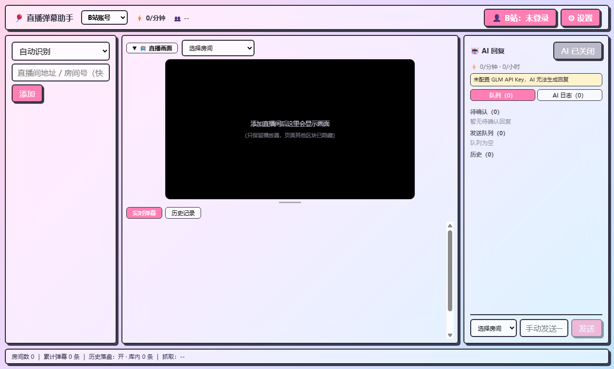
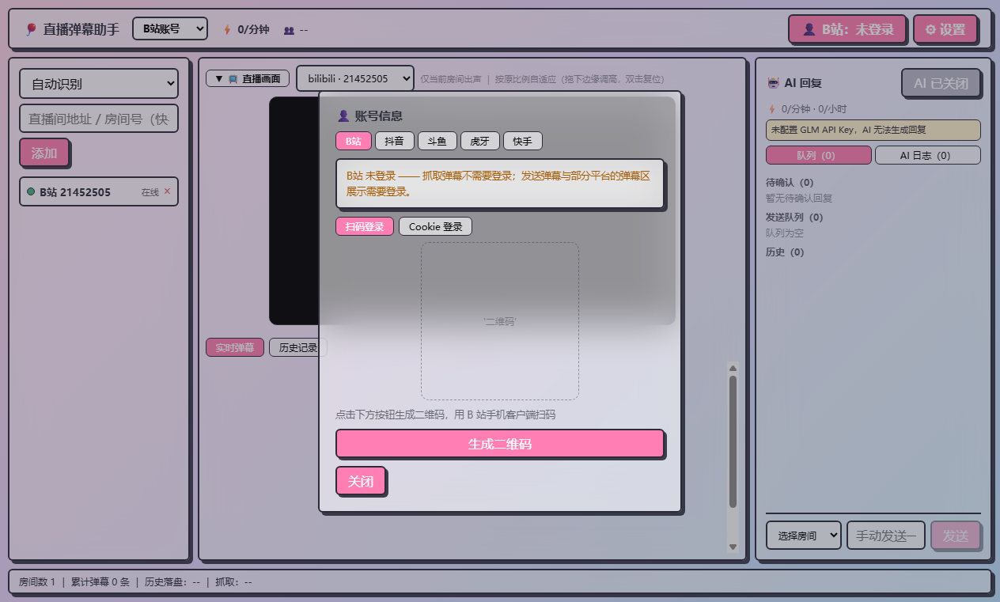

<div align="center">

# 🎈 直播弹幕助手 StreamReply_AI

**多平台直播间弹幕捕获 · AI 智能回复 · 一站式管理**

五端接入 · 实时捕获 · AI 互动 · 本地留存


</div>

> **开发阶段声明**：项目处于开发中。首次使用请在设置中填写智谱 API Key（仅本地保存）；
> 平台登录 Cookie 明文存储于本机 `platform-accounts.json`，请勿外传。**勿提交** `.env.local` 与 `settings.json`。

面向直播场景的桌面全栈应用：挂载各平台网页端直播间 → 实时捕获弹幕 → 拆出「用户 + 内容」→ 智谱 GLM 生成回复 → 防风控自动发回直播间。业务数据来自本地数据库实时查询，支持多平台账号管理与弹幕数据导出。

## ✨ 界面预览

**主界面** —— 左：房间管理 · 中：直播画面 + 实时弹幕流 · 右：AI 回复面板



**账号信息面板** —— 左上切换平台，五平台账号统一管理、扫码登录



## 🧩 功能特性

- **五平台弹幕捕获**：B站（主进程直连 WS）/ 抖音（CDP 抓帧）/ 斗鱼（CDP 抓帧）/ 虎牙（DOM 兜底）/ 快手（页面注入）—— 每平台按真实协议逆向，各自适配最优通道
- **AI 智能回复**：智谱 GLM 驱动，5 种触发模式（智能 / 全部 / 仅提问 / 关键词 / 随机），回复带情绪标签
- **防风控发送**：8~25 秒随机延迟、限频、熔断、敏感词去重、待确认队列；发送结果「确认模式」校验（输入框清空才算成功，杜绝假成功）
- **五平台统一账号体系**：左上切换平台，扫码登录（B站/快手/斗鱼应用内直出官方二维码）、Cookie 导入、多账号一键切换
- **直播画面搬移**：把网页端播放器直接搬进画面区（不拉流、零额外带宽），纯视频裁切 + 输入框让路
- **数据留存与导出**：弹幕全量自动写入本地 SQLite；按房间/关键词筛选后一键导出 CSV（Excel 友好）/ JSON

## 🖥 平台支持矩阵

| 平台 | 抓取通道 | 发送 | 登录方式 |
|---|---|---|---|
| B站 | 主进程直连 WS + WBI 签名 | ✅ | 应用内扫码 / Cookie / 登录窗口 |
| 抖音 | CDP 抓帧（protobuf） | ✅ | 官方登录窗口 / Cookie 导入 |
| 斗鱼 | CDP 抓帧（STT 协议） | ✅ | 应用内扫码 / Cookie 导入 / 登录窗口 |
| 虎牙 | DOM 兜底（JCE 解析器备用） | ✅ | 官方登录窗口 / Cookie 导入 |
| 快手 | 页面注入（protobuf） | ✅ | 应用内扫码 / Cookie 导入 / 登录窗口 |

> 抓取弹幕**不需要登录**；发送需要对应平台账号。快手/抖音/虎牙的弹幕区游客态可能不渲染，登录后即正常。

## 🚀 快速开始

```bash
npm install          # 安装依赖
npm run dev          # 开发模式
npm run build        # 构建
npm run dist         # 打包 NSIS 安装包
```

1. 启动后在设置中填写智谱 API Key（[申请地址](https://open.bigmodel.cn/)）
2. 顶栏切换平台 → 点「添加」输入直播间地址或房间号
3. 「👤 账号信息」扫码登录对应平台，即可开启 AI 自动回复

## 🗂 项目结构

```
src/
├── main/
│   ├── adapters/          # 平台适配器（bilibili/douyin/douyu/huya/kuaishou）
│   ├── ai/                # GLM 回复管线 + 触发引擎
│   ├── auth/              # 五平台账号体系 + 扫码/Cookie 登录
│   ├── db/                # SQLite 留存 + 导出
│   ├── sender/            # 防风控发送调度器
│   └── webview/           # WebView 管理 / CDP 抓帧 / 注入脚本
├── preload/               # IPC 隔离桥（主窗口 + WebView 双入口）
└── renderer/              # Vue 3 UI（三栏布局）
tests/                     # Vitest 全量测试
```

## 📄 免责声明

本项目仅供学习与技术交流，请遵守各平台用户协议，不要用于恶意刷屏等违规行为。使用本项目产生的一切后果由使用者自行承担。
